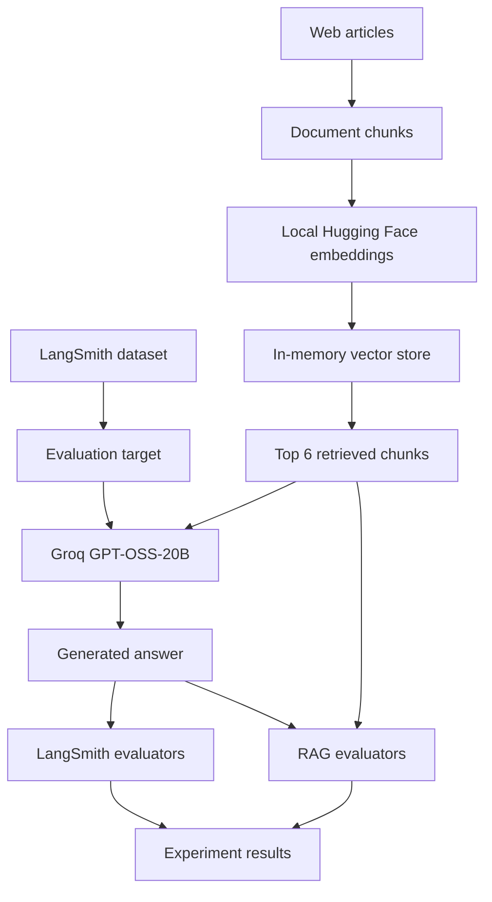

# 🧠 LLM Evaluation with LangSmith

> A practical project for building, tracing, and evaluating LLM applications using **LangSmith**, **LangChain**, **Groq**, and **Hugging Face embeddings**.

This project explores how to systematically evaluate LLM applications instead of relying only on subjective inspection of generated answers.

It covers two stages:


The project uses **Groq's `openai/gpt-oss-20b`** for LLM generation and LLM-as-a-judge evaluation, avoiding dependency on paid OpenAI API access.

[new_code]
# LLM Evaluation with LangSmith

An end-to-end example of evaluating LLM applications with **LangSmith**, **LangChain**, **Groq**, and local **Hugging Face embeddings**.

The project demonstrates two evaluation workflows:

1. **Basic chatbot evaluation**: run a Groq-powered answer generator against a LangSmith dataset and score correctness and concision.
2. **RAG evaluation**: load web articles, retrieve relevant chunks, generate an answer, and score the answer and retrieved context with multiple LLM-as-a-judge evaluators.

The project uses Groq's `openai/gpt-oss-20b` model for generation and judging. It does not require an OpenAI API key. LangSmith stores datasets, traces, experiments, and evaluation results so runs can be compared instead of inspected only by hand.

## What This Project Highlights

| Capability | How it is demonstrated |
| --- | --- |
| Dataset-based evaluation | Creates LangSmith datasets with questions and reference answers |
| LLM-as-a-judge | Uses Groq to grade generated answers against explicit criteria |
| RAG | Loads three web articles, splits them into chunks, embeds them locally, and retrieves the top six chunks |
| Structured grading | RAG judges return typed JSON-style results containing an explanation and boolean score |
| Observability | LangSmith tracks target runs, traces, experiments, and evaluator results |
| Rate-limit awareness | RAG evaluation uses `max_concurrency=1` for controlled Groq usage |
| Local embeddings | `sentence-transformers/all-MiniLM-L6-v2` runs locally through Hugging Face |

## Architecture



### Basic chatbot evaluation

`app/eval/run_evals.py` sends each dataset question to a small target application. The target calls Groq through the OpenAI-compatible API and returns a response. LangSmith then runs:

- **Correctness**: an LLM judge compares the response with the reference answer.
- **Concision**: checks that the response is less than twice the reference answer length.

### RAG evaluation

`app/eval/rag_pipeline.py` builds the RAG system when imported:

1. Loads articles about agents, prompt engineering, and adversarial attacks from Lilian Weng's blog.
2. Splits the documents with a recursive text splitter using a chunk size of 250 tokens.
3. Creates local `all-MiniLM-L6-v2` embeddings.
4. Stores vectors in an in-memory vector store.
5. Retrieves the six most relevant chunks for each question.
6. Asks Groq to answer using the retrieved content, with a maximum of three sentences.

The RAG experiment evaluates:

- **Correctness**: factual accuracy against the reference answer.
- **Relevance**: whether the answer addresses the question.
- **Groundedness**: whether the answer is supported by retrieved documents.
- **Retrieval relevance**: whether the retrieved documents relate to the question.

## Requirements

- Python 3.10 or newer
- A [Groq API key](https://console.groq.com/keys)
- A [LangSmith API key](https://smith.langchain.com/)
- Internet access for Groq, LangSmith, and the source web pages
- Enough local disk space for the first Hugging Face embedding model download

## Setup

Run these commands from the repository root:

```bash
python -m venv .venv
```

Activate the virtual environment:

```powershell
# Windows PowerShell
.\.venv\Scripts\Activate.ps1
```

```bash
# macOS/Linux
source .venv/bin/activate
```

Install dependencies:

```bash
python -m pip install --upgrade pip
python -m pip install -r requirements.txt
```

Create a `.env` file in the repository root:

```dotenv
GROQ_API_KEY=your_groq_api_key
LANGSMITH_API_KEY=your_langsmith_api_key
LANGSMITH_TRACING=true
```

The application validates all three variables when `app.constants.environ` is imported. Keep `.env` private and do not commit API keys.

## Running the Project

### 1. Create the basic evaluation dataset

This creates the LangSmith dataset named `Chatbot Evaluation` with six questions and reference answers:

```bash
python -m app.eval.datapoints
```

Run the basic chatbot experiment:

```bash
python -m app.eval.run_evals
```

The experiment is saved in LangSmith with the prefix `groq-gpt-oss-20b-chatbot`.

### 2. Create the RAG evaluation dataset

This creates the LangSmith dataset named `RAG Test Evaluation` with questions about the source articles:

```bash
python -m app.eval.rag_datapoints
```

Run the RAG experiment:

```bash
python -m app.eval.run_rag_evals
```

The RAG run uses `max_concurrency=1` and is saved with the prefix `groq-gpt-oss-20b-rag`. The first run may take longer because it downloads the embedding model and loads the web pages.

### 3. Run a single RAG query

To inspect one generated answer and its retrieved documents:

```bash
python -m app.eval.rag_pipeline
```

The command prints the answer and the first 500 characters of each retrieved document.

## Project Structure

```text
.
├── README.md
├── requirements.txt
└── app/
       ├── main.py
       ├── constants/
       │   ├── environ.py       # Environment variable loading and validation
       │   └── get_models.py    # Optional Groq model-list request
       └── eval/
              ├── datapoints.py    # Basic chatbot dataset
              ├── llm_as_judge.py  # Basic correctness and concision evaluators
              ├── rag_datapoints.py # RAG dataset
              ├── rag_evaluator.py  # Structured RAG evaluators
              ├── rag_pipeline.py    # Loading, retrieval, generation, and tracing
              ├── run_evals.py      # Basic LangSmith experiment
              └── run_rag_evals.py  # RAG LangSmith experiment
```

## LangSmith Workflow

After running an experiment, open the LangSmith project associated with the configured API key to inspect:

- Individual target inputs and outputs
- Trace data for the generation and RAG pipeline
- Evaluator explanations and boolean scores
- Experiment-level comparisons
- Metadata such as the generation and embedding model names

Create each dataset before its corresponding evaluation run. Dataset creation is a separate script and is not automatically performed by the experiment scripts.

## Configuration Notes

- The default generation and judge model is `openai/gpt-oss-20b` through Groq.
- The RAG pipeline currently uses a fixed list of three URLs in `app/eval/rag_pipeline.py`.
- The vector store is in memory, so it is rebuilt on every process start and is not persisted between runs.
- RAG evaluation requires the dataset reference output field to be named `answer`.
- The basic evaluation target returns its generated text in the `response` field.
- `LANGSMITH_TRACING=true` enables tracing; LangSmith credentials are still required for dataset and evaluation operations.

## Troubleshooting

**Missing environment variable**

Confirm that `.env` is in the repository root and contains all three required values. Run commands from the repository root so `python-dotenv` can find it.

**Web loading or embedding errors**

Check internet access. The RAG pipeline downloads source pages and may download the embedding model on its first run.

**Groq rate limits**

Keep RAG concurrency at `1`, reduce the dataset size, or wait before rerunning the experiment.

**Dataset already exists**

The dataset scripts create named datasets. If LangSmith rejects a duplicate name, reuse the existing dataset or choose a new name in the relevant script.

## License

See [LICENSE](LICENSE).
## ✨ Features

- 🔥 LLM application evaluation with LangSmith
- 📊 Dataset-based evaluation
- ⚖️ LLM-as-a-judge evaluation
- 🧪 Multiple evaluation criteria
- 🔎 Retrieval-Augmented Generation (RAG)
- 📚 Web document loading
- ✂️ Document chunking
- 🧮 Local Hugging Face embeddings
- 🗂️ In-memory vector store
- 🧠 Groq-powered answer generation
- 📝 Structured evaluator outputs
- 🔭 LangSmith tracing and experiment tracking
- 🚦 Concurrency control for Groq rate limits

---

# 🏗️ Project Architecture

```text
                         ┌──────────────────────┐
                         │     LangSmith        │
                         │                      │
                         │  Datasets            │
                         │  Tracing             │
                         │  Experiments          │
                         │  Evaluation Results   │
                         └──────────┬───────────┘
                                    │
                                    ▼
                         ┌──────────────────────┐
                         │       RAG Bot        │
                         │                      │
                         │   Groq GPT-OSS-20B   │
                         └──────────┬───────────┘
                                    │
                    ┌───────────────┴───────────────┐
                    │                               │
                    ▼                               ▼
             Retrieved Documents              Generated Answer
                    │                               │
                    └───────────────┬───────────────┘
                                    ▼
                         ┌──────────────────────┐
                         │     Evaluators       │
                         │                      │
                         │  ✓ Correctness       │
                         │  ✓ Relevance         │
                         │  ✓ Groundedness      │
                         │  ✓ Retrieval         │
                         │    Relevance         │
                         └──────────────────────┘