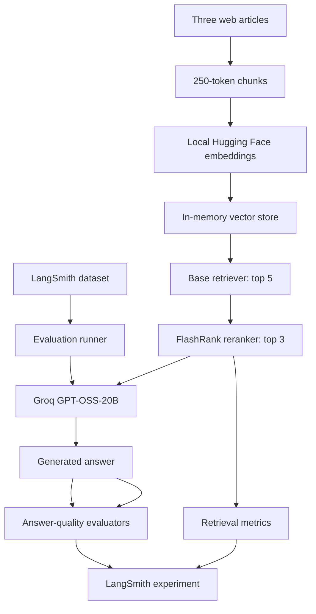
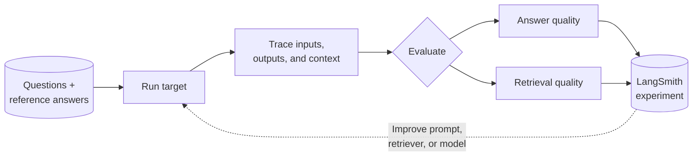
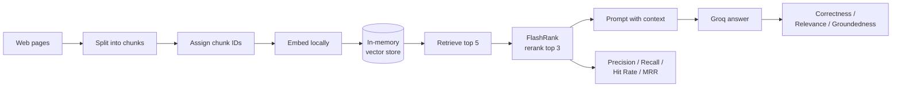
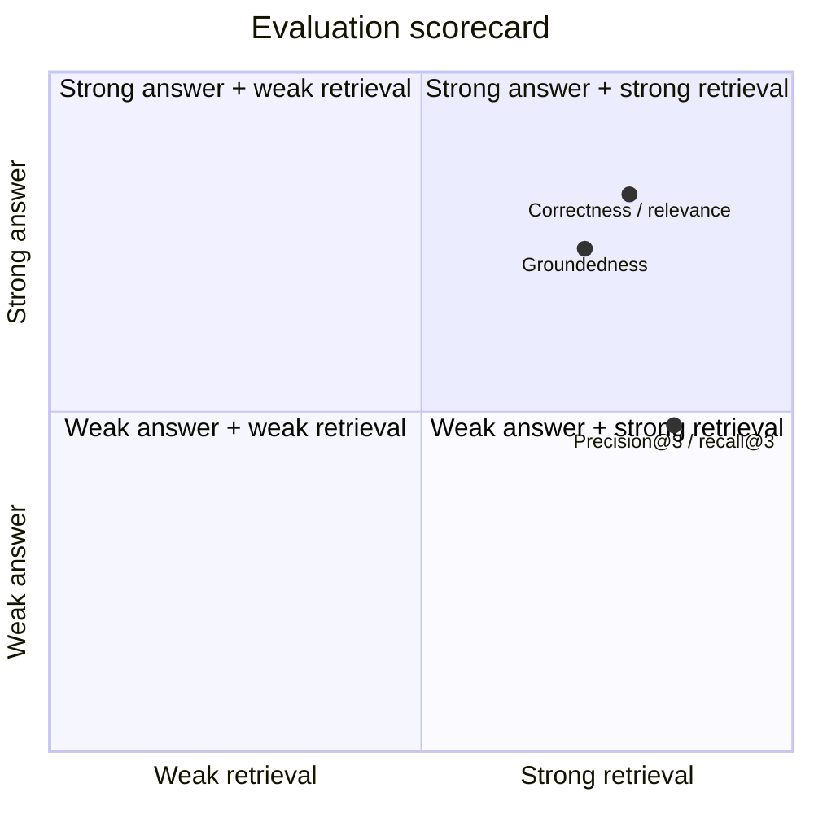

# LLM Evaluation with LangSmith

An end-to-end project for building, tracing, and evaluating LLM applications with **LangSmith**, **LangChain**, **Groq**, and local **Hugging Face embeddings**.

The repository demonstrates three complementary evaluation workflows:

1. **Basic chatbot evaluation**: generate answers with Groq and evaluate correctness and concision.
2. **RAG answer evaluation**: retrieve web-document context, generate an answer, and evaluate correctness, relevance, groundedness, and retrieval relevance with LLM judges.
3. **Retrieval quality evaluation**: compare retrieved chunks against known relevant chunk IDs using Precision@3, Recall@3, Hit Rate@3, and Mean Reciprocal Rank@3.

Groq's `openai/gpt-oss-20b` is used for answer generation and LLM-as-a-judge evaluation. The project does not require an OpenAI API key. LangSmith stores datasets, traces, experiments, evaluator results, and run metadata for inspection and comparison.

## Features

- LangSmith dataset creation and experiment tracking
- Groq generation through the OpenAI-compatible API
- LLM-as-a-judge evaluation with structured boolean grades and explanations
- Retrieval-Augmented Generation over three web articles
- Recursive document chunking with stable `chunk_0000`-style identifiers
- Local `sentence-transformers/all-MiniLM-L6-v2` embeddings
- In-memory vector search with FlashRank reranking
- Answer-quality metrics: correctness, relevance, groundedness, and retrieval relevance
- Deterministic retrieval metrics: precision, recall, hit rate, and reciprocal rank
- LangSmith tracing through `@traceable`
- Controlled evaluation concurrency for Groq rate limits

## Architecture



### The evaluation flywheel

Each run turns a dataset into an observable experiment, then feeds the results back into the next iteration of the application.



### The RAG journey

The RAG pipeline keeps retrieval and generation connected while preserving the chunk IDs needed for deterministic evaluation.



### Two lenses on quality

An answer can sound convincing even when retrieval is weak, so the project measures both sides independently.



## Evaluation Workflows

### 1. Basic chatbot evaluation

`app/eval/runners/run_evals.py` evaluates a small Groq-powered target application against the `Chatbot Evaluation` dataset.

- **Correctness**: an LLM judge compares the generated `response` with the reference `answer` and returns `CORRECT` or `INCORRECT`.
- **Concision**: passes when the generated response is less than twice the reference answer length.

The experiment prefix is `groq-gpt-oss-20b-chatbot`.

### 2. RAG answer evaluation

`app/rag/rag_pipeline.py` loads these source pages from Lilian Weng's blog:

- [LLM-powered Autonomous Agents](https://lilianweng.github.io/posts/2023-06-23-agent/)
- [Prompt Engineering](https://lilianweng.github.io/posts/2023-03-15-prompt-engineering/)
- [Adversarial Attacks on LLMs](https://lilianweng.github.io/posts/2023-10-25-adv-attack-llm/)

The pipeline:

1. Loads the web pages with `WebBaseLoader`.
2. Splits content with `RecursiveCharacterTextSplitter` using a 250-token chunk size and zero overlap.
3. Assigns each chunk a stable `chunk_id` such as `chunk_0005`.
4. Creates local `all-MiniLM-L6-v2` embeddings.
5. Indexes the chunks in an `InMemoryVectorStore`.
6. Retrieves the five nearest chunks.
7. Uses `FlashrankRerank(top_n=3)` through `ContextualCompressionRetriever` to keep the best three documents.
8. Prompts Groq to answer from the retrieved context in three sentences or fewer.

`app/eval/runners/run_rag_evals.py` evaluates the resulting `answer` and `documents` fields with:

- **Correctness**: factual accuracy relative to the reference answer.
- **Relevance**: whether the answer addresses the question.
- **Groundedness**: whether the answer is supported by the retrieved documents.
- **Retrieval relevance**: whether the retrieved documents relate to the question.

The experiment prefix is `groq-gpt-oss-20b-rag` and its LangSmith metadata records the generation and embedding models. Evaluation runs use `max_concurrency=1`.

### 3. Retrieval quality evaluation

`app/eval/runners/run_retrieval_evals.py` uses the same RAG target but evaluates retrieval independently from answer quality. `app/eval/datasets/rag_datapoints.py` defines the expected relevant chunk IDs for each question.

The evaluators inspect the top three reranked documents and report:

| Metric | Meaning |
| --- | --- |
| Precision@3 | Fraction of the top three retrieved documents that are relevant |
| Recall@3 | Fraction of all known relevant chunks found in the top three |
| Hit Rate@3 | Whether at least one relevant chunk appears in the top three |
| MRR@3 | Reciprocal rank of the first relevant chunk, or zero if none is found |

The experiment prefix is `groq-gpt-oss-20b-retrieval`. Its metadata records the vector store, reranker, retrieval settings, and embedding model.

## Requirements

- Python 3.10 or newer
- A [Groq API key](https://console.groq.com/keys)
- A [LangSmith API key](https://smith.langchain.com/)
- Internet access for Groq, LangSmith, Hugging Face model downloads, and source web pages
- Local disk space for the first embedding and reranker model downloads

## Setup

Run these commands from the repository root:

```bash
python -m venv .venv
```

Activate the environment:

```powershell
# Windows PowerShell
.\.venv\Scripts\Activate.ps1
```

```bash
# macOS/Linux
source .venv/bin/activate
```

Install the project dependencies:

```bash
python -m pip install --upgrade pip
python -m pip install -r requirements.txt
```

Create a `.env` file in the repository root:

```dotenv
GROQ_API_KEY=your_groq_api_key
LANGSMITH_API_KEY=your_langsmith_api_key
LANGSMITH_TRACING=true
```

`app/constants/environ.py` validates all three variables when imported. Keep `.env` private and never commit API keys.

## Running the Project

### Create the basic dataset

Creates the LangSmith dataset `Chatbot Evaluation` with six questions and reference answers:

```bash
python -m app.eval.datasets.datapoints
```

Run the basic experiment:

```bash
python -m app.eval.runners.run_evals
```

### Create the RAG dataset

Creates the LangSmith dataset `RAG Test Evaluation` with three questions, reference answers, and retrieval ground-truth chunk IDs:

```bash
python -m app.eval.datasets.rag_datapoints
```

Run the RAG answer-quality experiment:

```bash
python -m app.eval.runners.run_rag_evals
```

Run the retrieval-quality experiment:

```bash
python -m app.eval.runners.run_retrieval_evals
```

The first RAG-related run may take longer because it loads the web pages and downloads embedding/reranker model files. Dataset creation is separate from evaluation and must be completed first. Named datasets may need to be reused or renamed if they already exist in LangSmith.

### Inspect the RAG pipeline

Running the pipeline module searches the prepared chunks for a list of keywords and prints matching chunk IDs, source URLs, and content:

```bash
python -m app.rag.rag_pipeline
```

The RAG pipeline also exposes `rag_bot(question)`, which returns:

```python
{
    "answer": "...",
    "documents": [/* reranked Document objects */],
}
```

### List available Groq models

```bash
python -m app.constants.get_models
```

## Project Structure

```text
.
├── README.md
├── requirements.txt
└── app/
    ├── main.py
    ├── constants/
    │   ├── environ.py                    # Environment loading and validation
    │   └── get_models.py                 # Groq model-list request
    ├── rag/
    │   └── rag_pipeline.py               # Loading, indexing, reranking, and generation
    └── eval/
        ├── datasets/
        │   ├── datapoints.py             # Basic chatbot dataset
        │   └── rag_datapoints.py         # RAG dataset and retrieval ground truth
        ├── evaluators/
        │   ├── instructions.py           # LLM judge prompts
        │   ├── llm_as_judge.py            # Basic correctness and concision
        │   ├── rag_evaluator.py           # RAG answer-quality judges
        │   └── retrieval_metrics.py       # Precision, recall, hit rate, and MRR
        └── runners/
            ├── run_evals.py               # Basic chatbot experiment
            ├── run_rag_evals.py           # RAG answer-quality experiment
            └── run_retrieval_evals.py     # Retrieval-quality experiment
```

## LangSmith Results

After running an experiment, open the LangSmith project associated with the configured API key to inspect:

- Target inputs and generated outputs
- Traces for the RAG pipeline and traced `rag_bot` calls
- LLM judge explanations and boolean scores
- Numeric retrieval metric scores
- Experiment-level comparisons
- Run metadata, including model, embedding, retriever, reranker, and top-k settings

## Configuration Notes

- The generation and judge model is `openai/gpt-oss-20b` through Groq.
- The embedding model is `sentence-transformers/all-MiniLM-L6-v2`.
- The vector store is in memory and is rebuilt every time the RAG module starts; it is not persisted.
- Base vector retrieval is configured for five documents and FlashRank reranking keeps three.
- Retrieval metric evaluators use the top three documents returned by the reranked pipeline.
- RAG reference outputs use the `answer` field; the basic target uses the `response` field.
- `LANGSMITH_TRACING=true` enables tracing, while LangSmith credentials are still required for dataset and evaluation operations.
- `flashrank==0.2.10` is pinned in `requirements.txt` for reranking.

## Troubleshooting

**Missing environment variable**

Confirm that `.env` is in the repository root and contains `GROQ_API_KEY`, `LANGSMITH_API_KEY`, and `LANGSMITH_TRACING`. Run commands from the repository root so `python-dotenv` can find it.

**Web, embedding, or reranker errors**

Check internet access and allow the first run to download the Hugging Face and FlashRank model files.

**Groq rate limits**

The RAG runners intentionally use `max_concurrency=1`. Keep that setting, reduce the dataset size, or wait before rerunning.

**Dataset already exists**

The dataset scripts create fixed names. Reuse the existing dataset or change the dataset name in the relevant dataset script.

**Retrieval metric lookup errors**

Retrieval metrics expect every evaluated question to exist in `RETRIEVAL_GROUND_TRUTH` and every retrieved document to have a `chunk_id` in its metadata.

## License

See [LICENSE](LICENSE).
